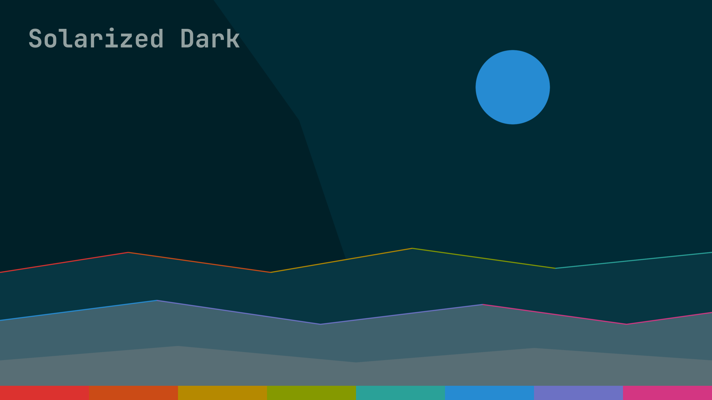

# Solarized Dark for Omarchy

A [Solarized Dark](https://ethanschoonover.com/solarized/) theme for
[Omarchy](https://omarchy.org/), built on the canonical 16-color Solarized
palette (eight monotones, eight accents) by Ethan Schoonover.

Companion theme: [omarchy-solarized-light](https://github.com/chadhs/omarchy-solarized-light)
— the two share accent values and mirrored monotone assignments, so switching
between them keeps the same feel, per Solarized's dual-mode design.



## Install

```bash
omarchy theme install https://github.com/chadhs/omarchy-solarized-dark.git
```

Or clone it wherever you like and copy/symlink it to
`~/.config/omarchy/themes/solarized-dark/`, then:

```bash
omarchy theme set solarized-dark
```

### Update

Pull the latest changes into an installed clone and re-apply it:

```bash
omarchy theme update          # pulls all git-installed themes
omarchy theme set solarized-dark
```

## Palette

| Solarized | Hex       | Omarchy role |
|-----------|-----------|--------------|
| base03    | `#002b36` | `background`, terminal color 0 |
| base02    | `#073642` | `selection`, `lighter_background`, `hyprland_inactive_border` |
| base01    | `#586e75` | `muted` (comments, disabled text, bright black) |
| base00    | `#657b83` | `dark_foreground` |
| base0     | `#839496` | `foreground` (body text) |
| base1     | `#93a1a1` | `light_foreground`, `bright_foreground` (cursor) |
| yellow    | `#b58900` | `yellow` |
| orange    | `#cb4b16` | `orange` |
| red       | `#dc322f` | `red` |
| magenta   | `#d33682` | `magenta` |
| violet    | `#6c71c4` | `brown` (8th accent slot) |
| blue      | `#268bd2` | `accent`, `blue` |
| cyan      | `#2aa198` | `cyan`, second active-border gradient stop |
| green     | `#859900` | `green` |

### Design notes

- Text pairing follows Schoonover's own reading pairs rather than a new
  hierarchy: `base03:base0` for body text on the plain background and
  `base02:base1` for text on highlighted surfaces (selection, raised panels,
  cursorline). The L\*a\*b lightness difference between the two pairs is
  identical by design.
- `darker_background` shades (`#002028`, `#00151b`) are base03 darkened
  toward black, keeping the hue, for sinks/floats; `lighter_background` is
  base02, the canonical highlighted-surface tone.
- The Hyprland active border is a blue→cyan gradient (`#268bd2 #2aa198
  45deg`) over the base03 background; the inactive border is base02.
- Accents are kept identical between the dark and light themes, matching
  Solarized's terminal palettes, so syntax colors don't shift between modes.

## Backgrounds

Three generated, palette-only wallpapers in `backgrounds/`:

1. `1-ridge.png` — calm low-poly landscape (default): a single faceted sky
   over three gently rolling ridges, a round blue moon, and hairlines along
   the ridges sweeping through all eight Solarized accents — red, orange,
   yellow, green, and cyan on the far ridge; blue, violet, and magenta on
   the mid ridge. This is also the wallpaper used for the theme previews.
2. `2-dusk.png` — diagonal base02→base03 fade
3. `3-glow-blue.jpg` — radial blue glow on base03
4. `4-glow-cyan.jpg` — radial cyan glow on base03

Cycle with `omarchy theme bg next`, or add your own to
`~/.config/omarchy/backgrounds/solarized-dark/`.

## Scope

`colors.toml` is the source of truth: Omarchy generates the terminal configs
(Alacritty, Foot, Kitty, Ghostty), Hyprland border colors, Neovim, btop,
VS Code, and shell/bar theming from it at `omarchy theme set` time. This repo
ships only palette-derived color data and imagery.

## Credits

- [Solarized](https://ethanschoonover.com/solarized/) palette by Ethan
  Schoonover (MIT).
- Role mapping informed by the same reading-pair approach used in the
  [Solarized theme for T3 Code](https://github.com/chadhs/dotfiles/tree/master/utils/t3-code/themes/solarized).
